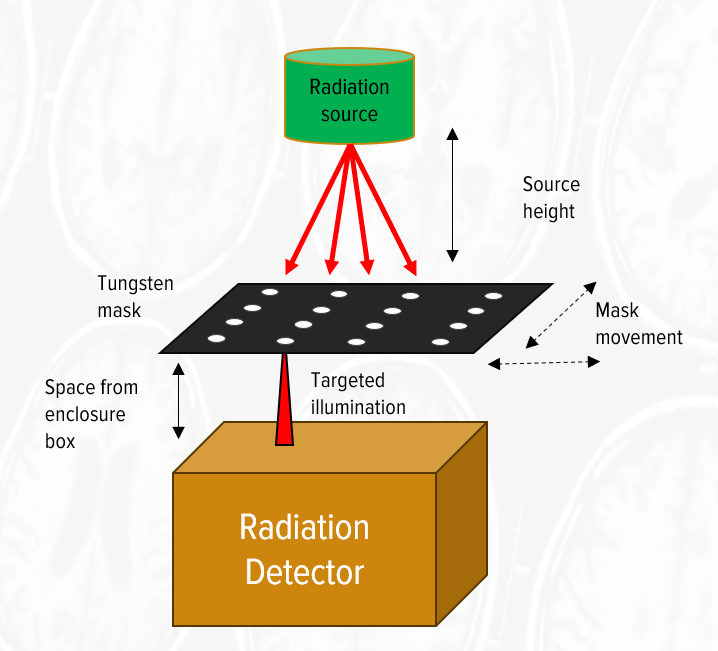

# Abstract
This is a dashboard for analyzing the data from our shadow mask experiment in our radiation detector. We use a tungsten mask of 4x4 holes to localized the light into small sub-pixel areas of our detector, which negates the effects of neigboring pixels and isolates the detector response to a single pixel. We want to see the energy spectrum and count rate for each pixel as the mask traverses and illuminates different areas and pixels of the detector. 

